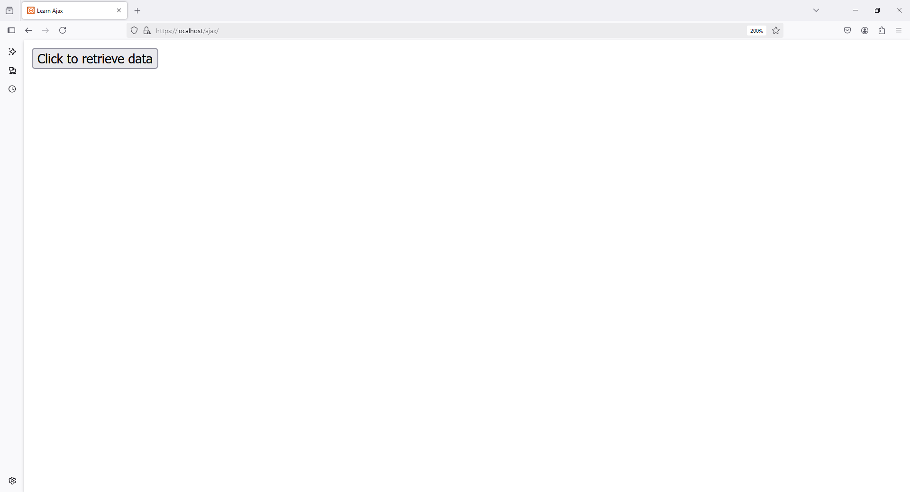
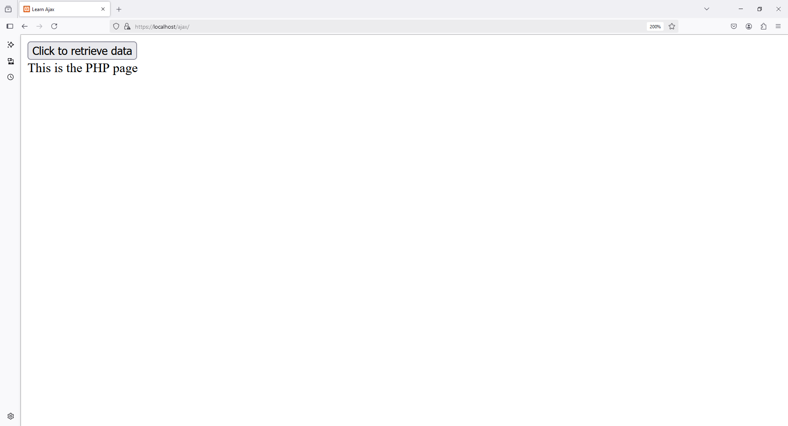

1 - Create `index.html`

```
under XAMPP -> htdocs -> project_folder -> index.html
```

2 - `index.html`

```html
<!DOCTYPE html>
<html lang="en">
<head>
    <meta charset="UTF-8">
    <meta http-equiv="X-UA-Compatible" content="IE=edge">
    <meta name="viewport" content="width=device-width, initial-scale=1.0">
    <title>Learn Ajax</title>
    <script>

        function ajax_func() {
            var xmlhttp = new XMLHttpRequest();

            xmlhttp.onreadystatechange = function(){

                if (xmlhttp.readyState == 4 && xmlhttp.status == 200) 
                {
                    var receiver = document.getElementById('get_data');   

                    // receiver.innerHTML = "All is well";
                    
                    receiver.innerHTML = xmlhttp.responseText;
                }

            }

            xmlhttp.open('GET','process_ajax.php', true);

            xmlhttp.send();
        }

    </script>
</head>
<body>

    <button onclick="ajax_func();">Click to retrieve data</button>
    
    <div id="get_data"></div>
</body>
</html>
```

3 - Create `process_ajax.php`

```
under XAMPP -> htdocs -> project_folder -> process_ajax.php
```

4 - `process_ajax.php`

```php
<?php

    echo "This is the PHP page";

?>
```



