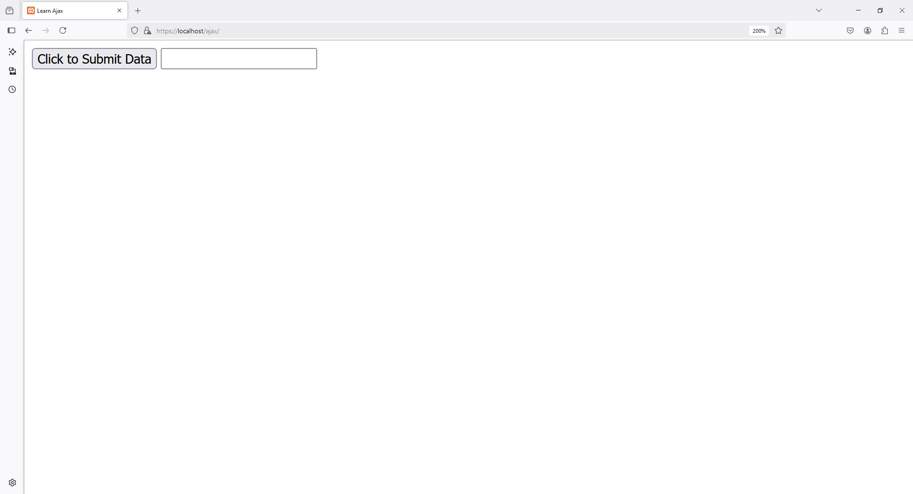
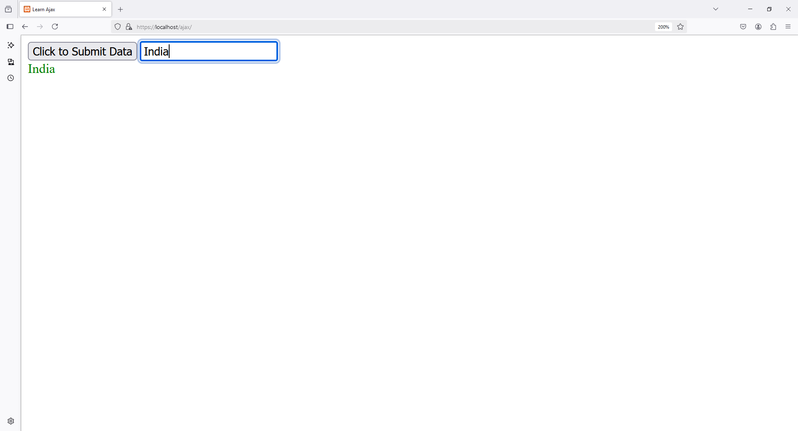

1 - Create `index.html`

```
under XAMPP -> htdocs -> project_folder -> index.html
```

2 - `index.html`

```html
<!DOCTYPE html>
<html lang="en">
<head>
    <meta charset="UTF-8">
    <meta http-equiv="X-UA-Compatible" content="IE=edge">
    <meta name="viewport" content="width=device-width, initial-scale=1.0">
    <title>Learn Ajax</title>
    <script>

        function ajax_func(user_input) {
            var xmlhttp = new XMLHttpRequest();

            // var user_input = document.getElementById('user-input').value;

            xmlhttp.onreadystatechange = function(){

                if (xmlhttp.readyState == 4 && xmlhttp.status == 200) 
                {
                    document.getElementById('ret_data').innerHTML = xmlhttp.responseText;
                }

            }

            xmlhttp.open('GET','process_ajax.php?var1=' + user_input, true);
            
            // xmlhttp.open('GET','process_ajax.php?var1=India', true);

            xmlhttp.send();
        }

    </script>
</head>
<body>

    <button id="btn" onclick="ajax_func();">Click to Submit Data</button>

    <!-- <input type="text" id="user-input"> -->
    
    <!-- <input type="text" id="user-input" onkeypress="ajax_func();"> -->
    
    <input type="text" id="user-input" onkeyup="ajax_func(this.value);">

    <div id="ret_data"></div>
</body>
</html>
```

3 - Create `process_ajax.php`

```
under XAMPP -> htdocs -> project_folder -> process_ajax.php
```


4 - `process_ajax.php`

```php
<?php

    $countries[] = "United States";
    $countries[] = "United Kingdom";
    $countries[] = "United Arab Emirates";
    $countries[] = "Brazil";
    $countries[] = "India";
    $countries[] = "China";
    $countries[] = "Sri Lanka";

    foreach ($countries as $country) 
    {
        // echo $country . "<br>";

        if (isset($_REQUEST['var1'])) 
        {
            if ($_REQUEST['var1'] == $country) 
            {
                echo '<div style="color: green;">' . $_REQUEST['var1'] . '</div>';
            }
        }
    }
?>
```



